## Language Analysis

**Мета роботи:** Написати програму для парсингу декількох текстових файлів і бінування отриманих даних.

**Репозиторій: <https://github.com/MaksimVarivodin/LanguageAnalysis/tree/UI_Functional_fix>**

**Ключові зміни і вимоги:** 

1. Працездатність програми при різних масштабах екрану і різній роздільній здатності(100%, 125%, 150%, 175%)
1. Відкриття і парсинг текстів.
1. Створення словників для папок з текстами.
1. Розрахунок бінування словників за різними методами.

Хід роботи(інструкція)

# **Відкрити папку з текстами**
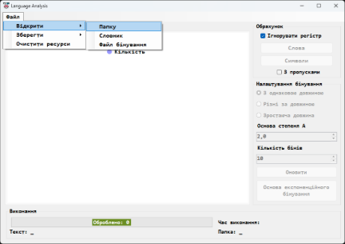

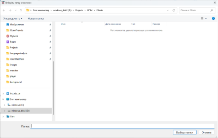

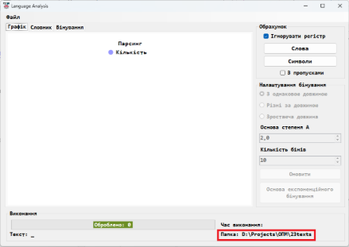
# **Порахувати слова в текстах**
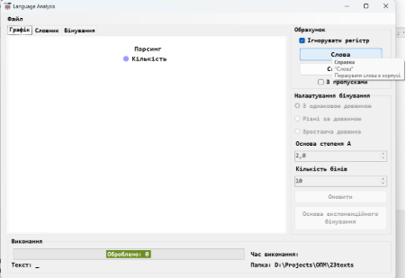

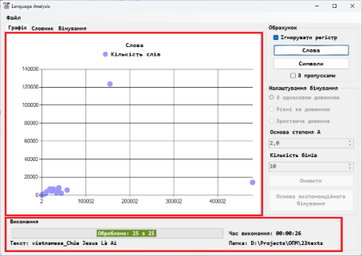

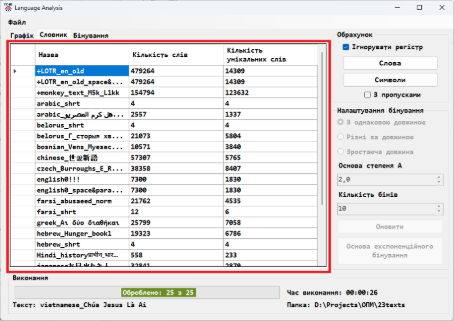

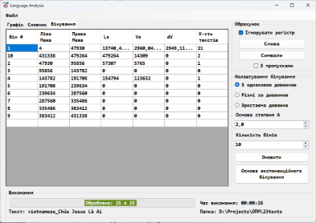
# **Порахувати символи в текстах**
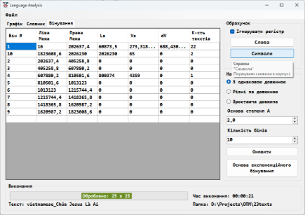
# **Ігнорувати регістр**
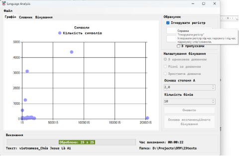
# **З пропусками**
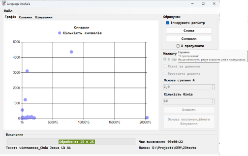
# **Відкрити словник**
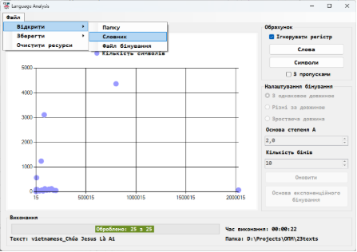

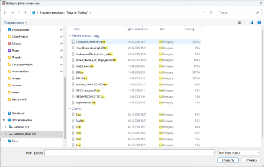

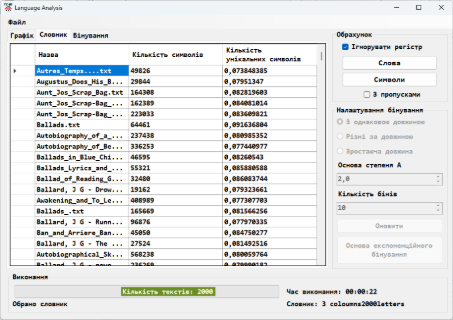
# **Відкрити файл бінування**
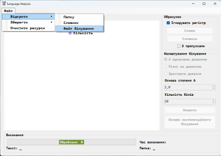

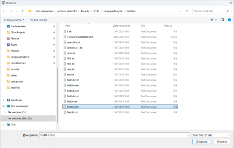

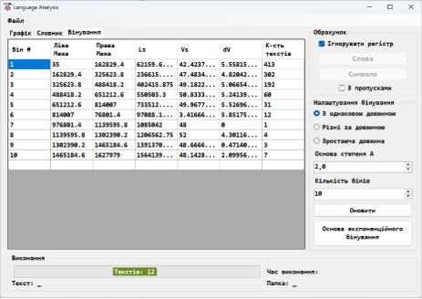
# **Зберегти словник у декількох форматах**
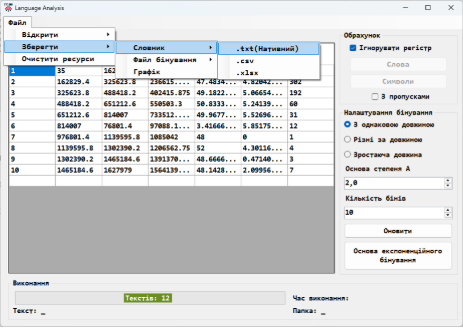

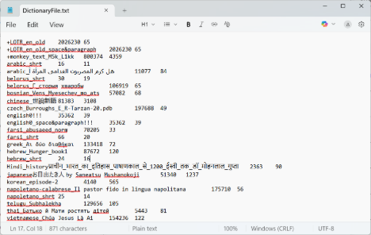

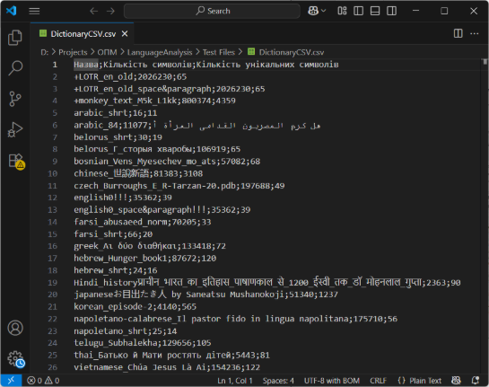

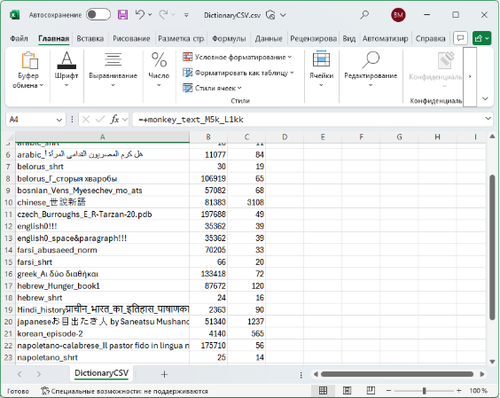

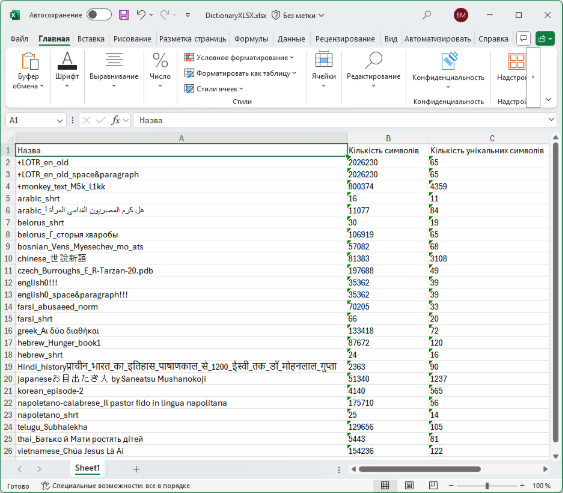
# **Зберегти файл бінування у декількох форматах**
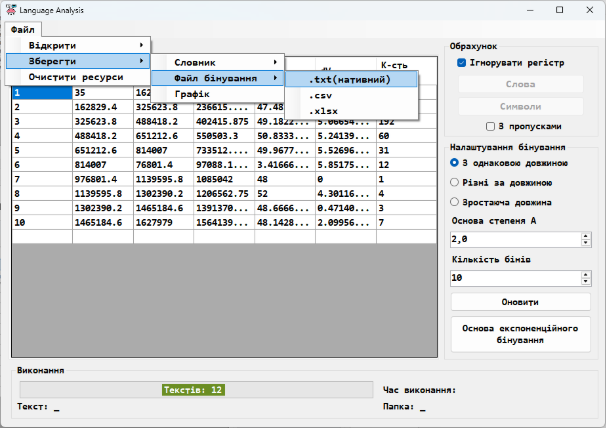

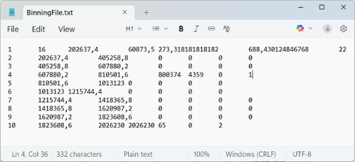

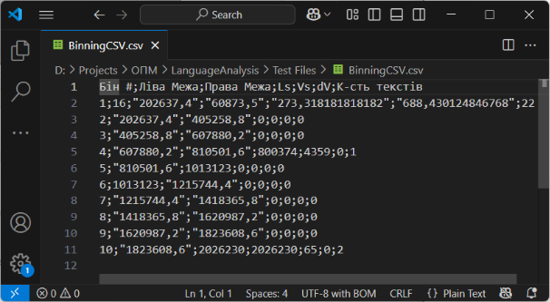

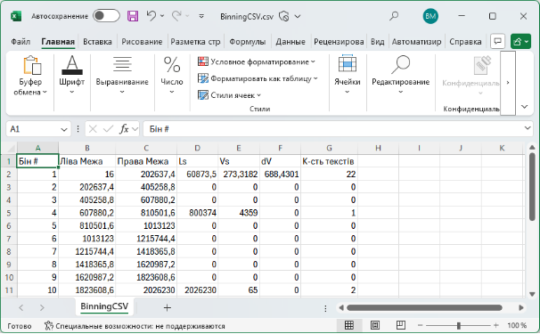

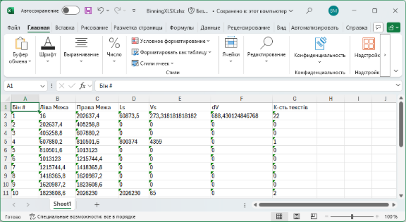
# **Зберегти графік**
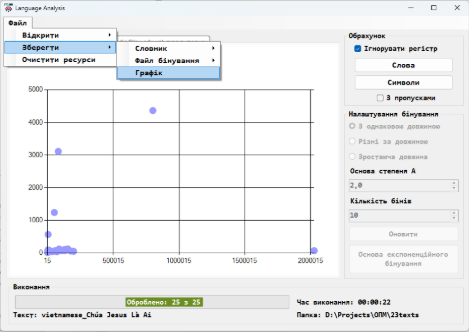
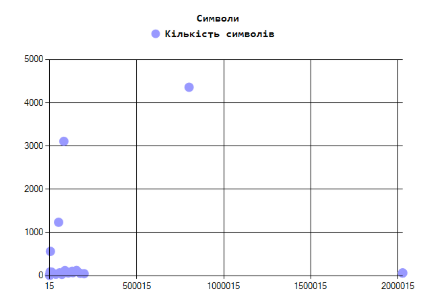
